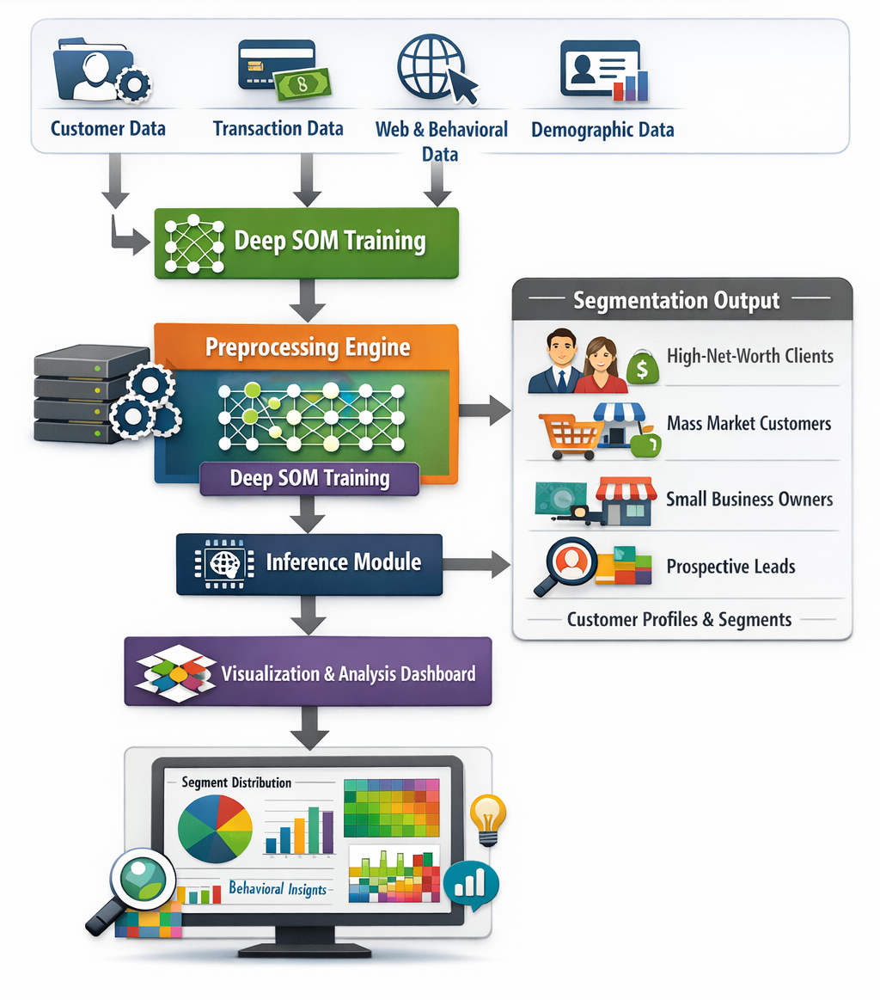
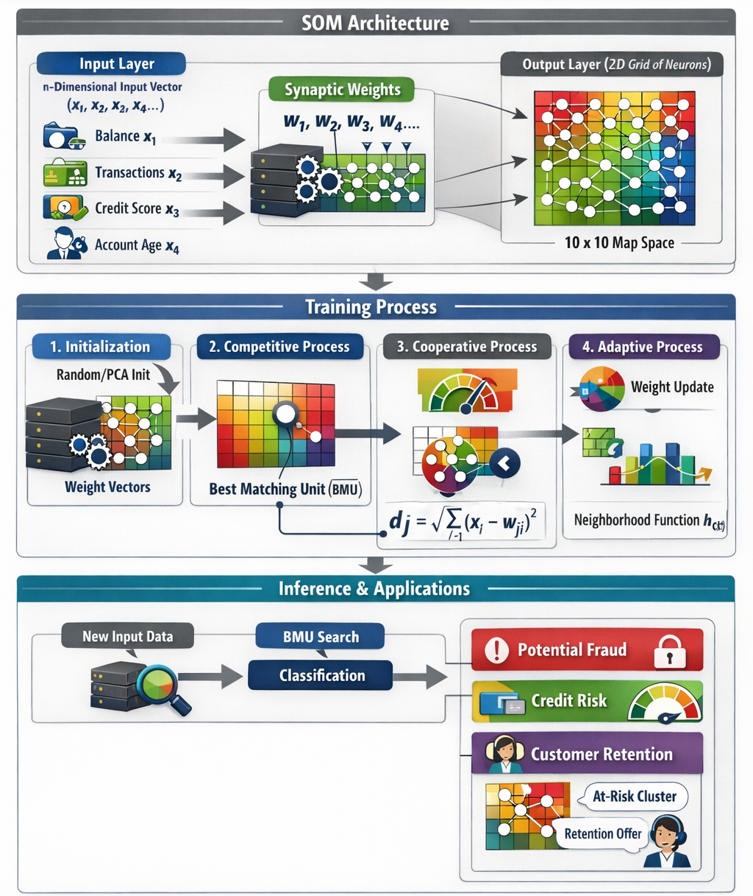
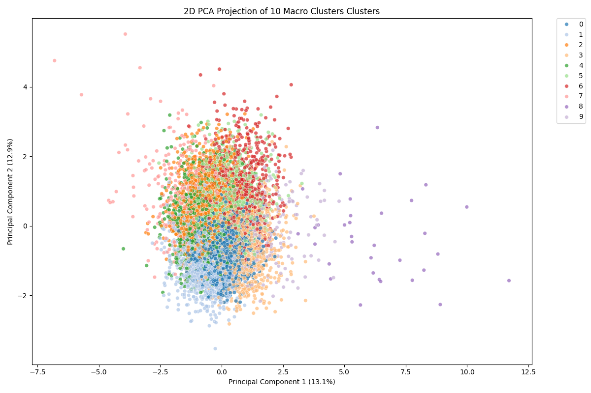
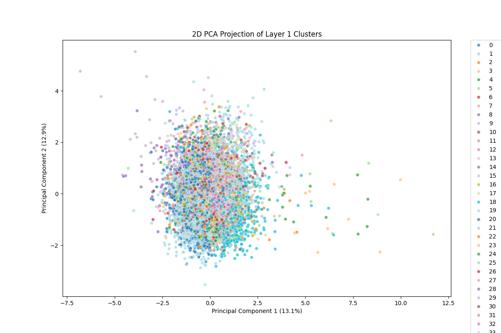
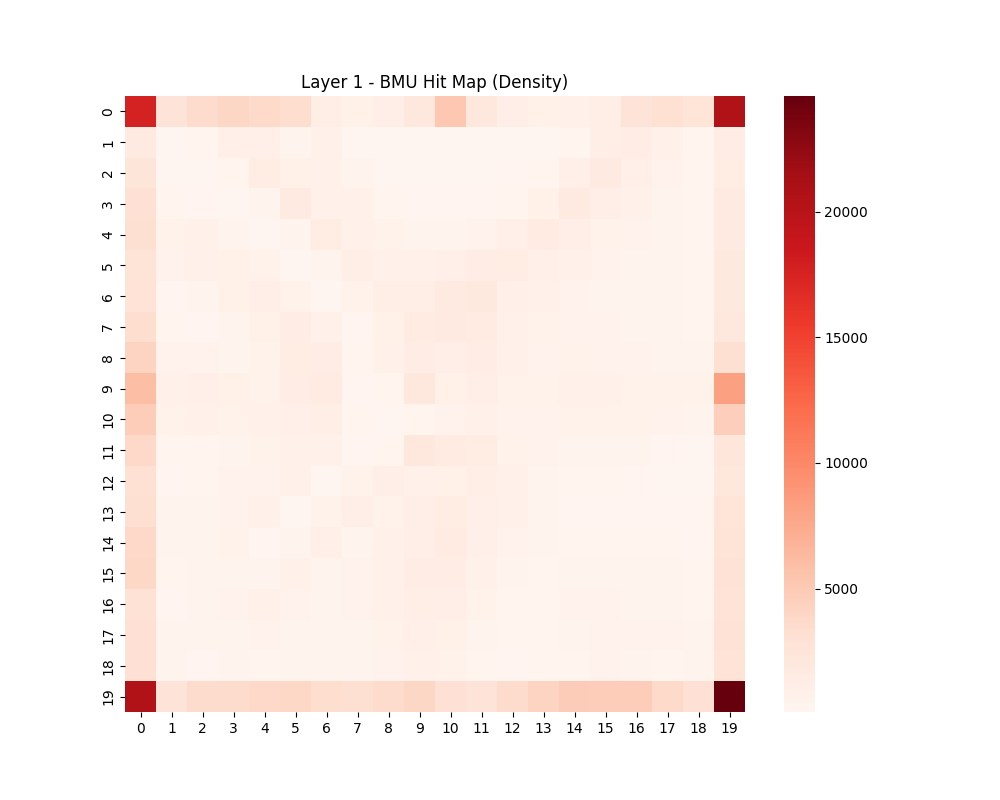
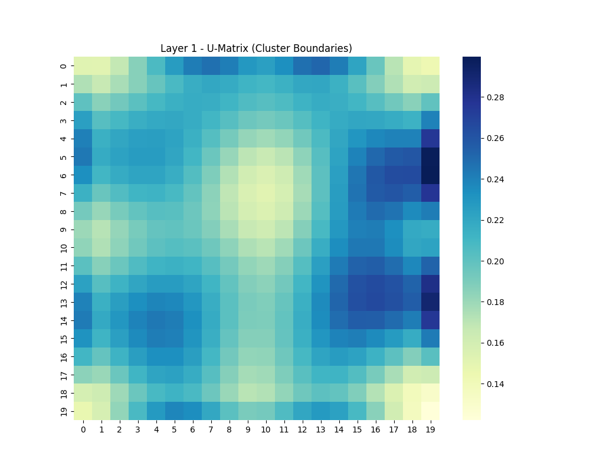
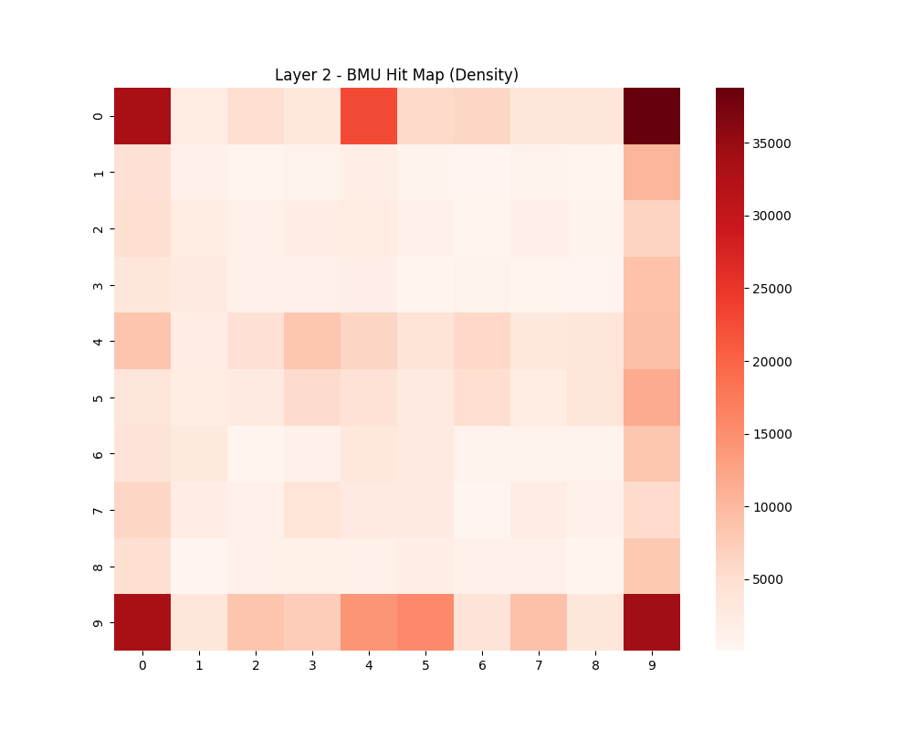
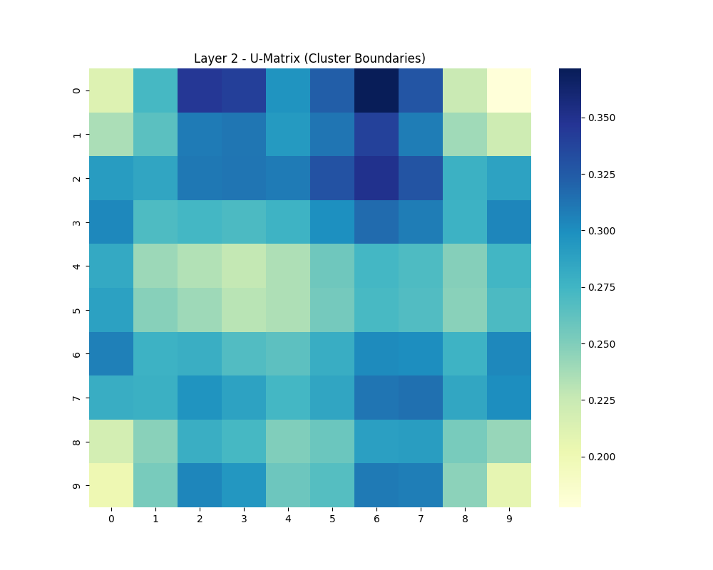

# Deep SOM Customer Segmentation

Hierarchical **Self Organizing Map (Deep SOM)** based customer segmentation pipeline designed for **large scale behavioral clustering** (millions of customers).

The system creates **micro-segments (Layer 1)** and **macro-segments (Layer 2)** using a 2-level SOM topology.

<div style="width:100%; display:flex; gap:20px;">
  

  
</div>

Supports:

* large scale datasets (10M+ customers)
* mixed feature types (numeric + categorical)
* missing data handling
* interpretable cluster topology
* 2D and 3D visualization
* hierarchical segmentation
---

# Architecture



---

# Dataset

Example synthetic dataset simulates financial behavioral signals:

| Feature                 | Description              |
| ----------------------- | ------------------------ |
| age                     | customer age             |
| estimated_annual_income | log-normal distribution  |
| credit_score            | bimodal distribution     |
| mobile_app_logins_30d   | engagement intensity     |
| push_notification_ctr   | marketing responsiveness |
| active_products_count   | cross-sell depth         |
| total_deposit_balance   | financial strength       |
| loan_inquiries_12m      | credit intent            |
| region                  | geographic segmentation  |
| employment_status       | demographic feature      |

Dataset includes:

* customers
* prospects
* missing values simulation
* skewed financial distributions

Example file:

```
data/
    part_0001_customers.parquet
```

---

# Deep SOM Model

Hierarchical SOM structure:

| Layer   | Grid Size | Purpose        |
| ------- | --------- | -------------- |
| Layer 1 | 20 x 20   | micro clusters |
| Layer 2 | 10 x 10   | macro clusters |

Total clusters:

```
Layer 1 → 400 micro segments
Layer 2 → 100 macro segments
```



---

# Installation

```bash
pip install numpy pandas torch scikit-learn matplotlib seaborn plotly pyarrow joblib
```

---

# How to Run

### 1. Train Deep SOM

```bash
python train.py
```

Outputs:

```
models/
    deep_som.pth
    preprocessor.joblib
```

---

### 3. Run inference (segment assignment)

```bash
python inference.py
```

Output:

```
models/mapped_data.parquet
```

columns added:

```
segment_l1
segment_l2
```

---

### 4. Generate topology visualizations

```bash
python visualize.py
```

---

### 5. PCA cluster visualization

```bash
python cluster_viz.py
```

---

# Visualization Results

---

# Macro Clusters (10 segments)

Shows high-level grouping of behavioral segments.



Observations:

* clusters show moderate separation
* some overlap indicates continuous behavior spectrum
* right tail cluster indicates high-value segment

---

# Layer 1 Micro Segments

Each color represents a micro behavioral segment.



Observations:

* dense cluster core indicates common behavioral patterns
* outliers represent niche customer profiles

---

# Layer 1 Density (Hit Map)

Shows how many customers map to each neuron.



Insights:

* corner nodes show high density
* indicates dominant behavioral archetypes
* sparse nodes indicate niche segments

---

# Layer 1 Cluster Boundary (U-Matrix)

Distance between neighboring neurons.



Insights:

* darker regions represent strong cluster separation
* useful for identifying segment boundaries

---

# Layer 2 Density (Macro Structure)

Higher level grouping of segments.



Insights:

* strong concentration in few macro clusters
* hierarchical grouping working effectively

---

# Layer 2 Cluster Boundary



Insights:

* clear macro segment boundaries
* interpretable behavioral grouping

---

# Interactive 3D Visualization

Interactive PCA visualization available:

| Layer 1 Viz                                |                        Macro cluster viz |
|------------------|------------------|
|  |  |

---

# Model Pipeline

### Preprocessing

Handles mixed feature types:

```
numeric → median imputation + scaling
categorical → one hot encoding
```

---

### SOM training

Mini-batch SOM update:

```
BMU(x) = argmin || x − w ||
```

Neighborhood update:

```
w(t+1) = w(t) + lr * h * (x − w(t))
```

Decay:

```
learning rate ↓ over epochs
neighborhood radius ↓ over epochs
```

---

# Project Structure

```
.
├── train.py
├── inference.py
├── som_core.py
├── visualize.py
├── cluster_viz.py
│
├── data/
│
├── models/
│   ├── deep_som.pth
│   ├── preprocessor.joblib
│   ├── mapped_data.parquet
│
├── visualizations/
│   ├── 2d_pca_10_Macro_Clusters.png
│   ├── 2d_pca_Layer_1.png
│   ├── Layer_1_hitmap.png
│   ├── Layer_1_umatrix.png
│   ├── Layer_2_hitmap.png
│   ├── Layer_2_umatrix.png
│   ├── 3d_interactive_10_Macro_Clusters.html
```

---

# Scalability

Efficient for very large datasets:

* mini-batch training
* GPU compatible
* memory efficient
* supports millions of records

Typical scale tested:

```
6 million synthetic users
```

Can scale to:

```
50M+ customers
```

---

# Use Cases

### banking

customer lifecycle segmentation

### fintech

credit risk personas

### marketing

behavioral targeting

### insurance

policyholder segmentation

### ecommerce

user personalization

---

